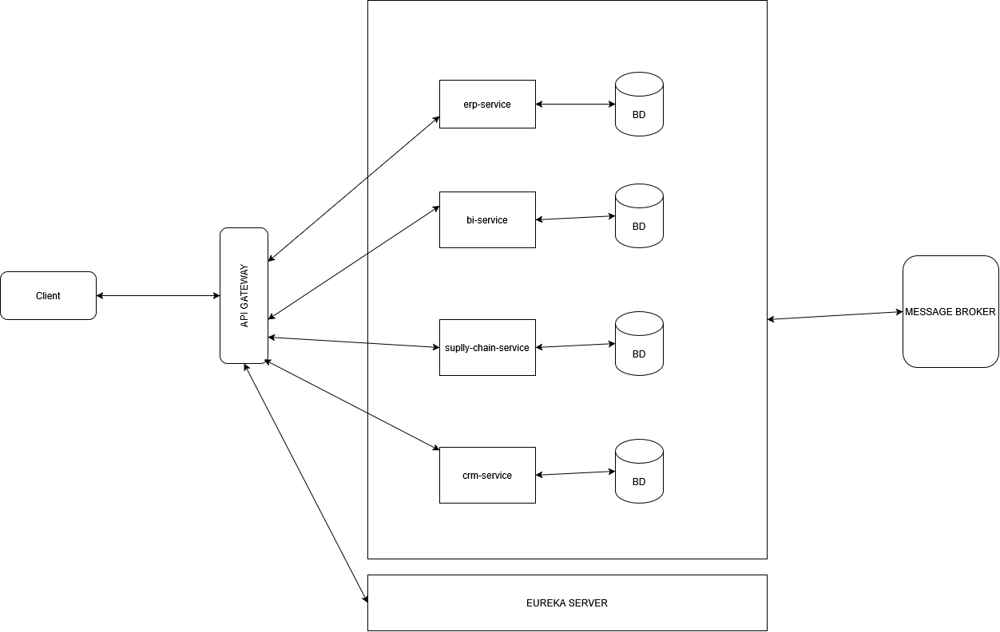

# Architecture du Projet DIGITRANS-CM

## 1. Présentation Générale

**DIGITRANS-CM** est une plateforme microservices conçue pour la gestion intégrée des opérations agricoles au Cameroun. Elle couvre la traçabilité de la production cacao/café, la gestion de la restauration (offline-first), et les ressources humaines / paie.

| Propriété | Valeur |
|-----------|--------|
| Java | 21 |
| Spring Boot | 3.3.5 |
| Build | Maven multi-module |
| Base package | `com.digitrans` |
| Port par défaut | 8080 – 8083 |

---

## 2. Vue d'Ensemble des Microservices



| Service | Port | Rôle |
|---------|------|------|
| **api-gateway** | 8080 | Authentification JWT, point d'entrée |
| **erp-service** | 8081 | Gestion RH, paie, employés |
| **crm-service** | 8082 | Restauration, commandes online/offline, fidélité |
| **supply-chain-service** | 8083 | Traçabilité cacao/café, entrepôts |
| **bi-service** | — | (squelette) Analyse décisionnelle |

---

## 3. Architecture Transversale (Sécurité)

Chaque microservice embarque sa propre couche sécurité **strictement identique**, permettant un fonctionnement autonome.

```
 ┌─────────────┐     ┌──────────────────┐     ┌──────────────┐
 │  Requête    │────▶│ JwtAuthFilter    │────▶│ Contrôleur   │
 │  + Bearer   │     │ (OncePerRequest) │     │  métier      │
 └─────────────┘     └──────────────────┘     └──────────────┘
                            │
                     ┌──────▼──────┐
                     │  JwtService  │
                     │ (HMAC-SHA256)│
                     └──────┬──────┘
                            │
                     ┌──────▼──────┐
                     │  Security   │
                     │   Config    │
                     └─────────────┘
```

### 3.1 Composants de sécurité

| Composant | Rôle |
|-----------|------|
| `SecurityConfig.java` | Désactive CSRF, active CORS, permet `/api/auth/**` + Swagger, tout le reste authentifié, session STATELESS |
| `JwtAuthenticationFilter.java` | Extrait le token Bearer, le valide via `JwtService`, positionne le `SecurityContextHolder` |
| `JwtService.java` | Génère et valide les tokens JWT signés HMAC-SHA256 (jjwt 0.12.3) |
| `AuthController.java` | `POST /api/auth/register` et `POST /api/auth/login` |
| `InMemoryUserRepository.java` | Stockage utilisateurs en mémoire (`ConcurrentHashMap`) |
| `UserEntity.java` | Implémente `UserDetails` Spring Security |

### 3.2 Authentification

```
POST /api/auth/register      → 201 + { token, username, role, expiresIn }
POST /api/auth/login         → 200 + { token, username, role, expiresIn }
```

Toutes les autres routes nécessitent un header `Authorization: Bearer <token>`.

### 3.3 Règles de sécurité (SecurityConfig)

| Pattern | Accès |
|---------|-------|
| `/api/auth/**` | Permitted (public) |
| `/swagger-ui/**`, `/v3/api-docs/**` | Permitted |
| Toute autre requête | Authenticated (JWT) |

### 3.4 CORS

- Origines autorisées : toutes (`*`)
- Méthodes : GET, POST, PUT, DELETE, OPTIONS, PATCH
- Headers : Authorization, Content-Type, Cache-Control

---

## 4. Supply Chain Service (8083) — Traçabilité Cacao/Café

### 4.1 Modèle de données

```
┌──────────────┐       ┌──────────────────┐       ┌─────────────────────┐
│  Plantation  │       │   HarvestBatch    │       │  TraceabilityEvent  │
│──────────────│       │──────────────────│       │─────────────────────│
│ id (PK)      │──1:N──│ id (PK)           │──1:N──│ id (PK)             │
│ code (uniq)  │       │ batchCode (uniq)  │       │ eventType (enum)    │
│ name         │       │ plantation (FK)   │       │ location            │
│ region       │       │ harvestDate       │       │ operatorName        │
│ ownerName    │       │ quantityKg        │       │ eventAt             │
│ productType  │       │ qualityGrade(A/B/C)│       │ metadata (JSON)    │
│ surfaceHa    │       │ status (enum)     │       │ hashSignature(SHA256)│
│ coordinates  │       │ currentLocation   │       └─────────────────────┘
└──────────────┘       │ blockchainTxHash  │
                       │ createdAt         │
                       └────────┬──────────┘
                                │ 1:1
                       ┌────────▼──────────┐
                       │  WarehouseStock    │
                       │───────────────────│
                       │ warehouseCode      │
                       │ warehouseName      │
                       │ quantityKg         │
                       │ status (AVAILABLE  │
                       │  /RESERVED/DISPATCH)│
                       └────────────────────┘
```

### 4.2 Entités

#### Plantation
| Champ | Type | Contraintes |
|-------|------|-------------|
| id | Long | PK, auto-généré |
| code | String | unique, non null |
| name | String | non null |
| region | String | |
| ownerName | String | |
| productType | `ProductType` | enum: `CACAO`, `CAFE` |
| surfaceHectares | Double | |
| active | Boolean | défaut `true` |
| geoCoordinates | String | |
| createdAt | LocalDateTime | `@CreationTimestamp` |

#### HarvestBatch
| Champ | Type | Contraintes |
|-------|------|-------------|
| id | Long | PK, auto |
| batchCode | String | unique, non null, format `BATCH-YYYY-NNN` |
| plantation | Plantation | `@ManyToOne(LAZY)`, non null |
| harvestDate | LocalDate | non null |
| quantityKg | Integer | non null |
| qualityGrade | `QualityGrade` | enum: `A`, `B`, `C` |
| status | `BatchStatus` | enum: `HARVESTED`, `IN_TRANSIT`, `AT_WAREHOUSE`, `PROCESSED`, `EXPORTED` |
| currentLocation | String | |
| notes | String (TEXT) | |
| blockchainTxHash | String | Hash simulé (SHA-256 factice) |
| createdAt | LocalDateTime | `@CreationTimestamp` |

#### TraceabilityEvent
| Champ | Type | Contraintes |
|-------|------|-------------|
| id | Long | PK, auto |
| batch | HarvestBatch | `@ManyToOne(LAZY)`, non null |
| eventType | `EventType` | enum: `HARVEST`, `QUALITY_CHECK`, `TRANSPORT_START`, `WAREHOUSE_ARRIVAL`, `PROCESSING`, `EXPORT_READY` |
| location | String | |
| operatorName | String | |
| eventAt | LocalDateTime | non null |
| metadata | String (TEXT) | JSON libre |
| hashSignature | String | SHA-256 du contenu |

#### WarehouseStock
| Champ | Type | Contraintes |
|-------|------|-------------|
| id | Long | PK, auto |
| warehouseCode | String | |
| warehouseName | String | |
| location | String | |
| batch | HarvestBatch | `@ManyToOne(LAZY)`, non null |
| quantityKg | Integer | non null |
| arrivalDate | LocalDate | |
| expiryDate | LocalDate | |
| status | `WarehouseStockStatus` | enum: `AVAILABLE`, `RESERVED`, `DISPATCHED` |

### 4.3 API Endpoints

```
POST   /api/supply/plantations              # Créer une plantation
GET    /api/supply/plantations              # Lister toutes les plantations
GET    /api/supply/plantations/{id}         # Détails d'une plantation
PUT    /api/supply/plantations/{id}         # Modifier une plantation
DELETE /api/supply/plantations/{id}         # Supprimer

POST   /api/supply/batches                  # Créer un lot (déclenche event HARVEST)
GET    /api/supply/batches/{batchCode}/trace    # Chaîne de traçabilité complète
GET    /api/supply/batches/{batchCode}/verify   # Vérifier l'intégrité (SHA-256)
PUT    /api/supply/batches/{batchCode}/status   # Changer statut (déclenche event)
GET    /api/supply/batches/plantation/{id}      # Lots par plantation (filtre date)

GET    /api/supply/events?batchCode=         # Événements d'un lot
GET    /api/supply/warehouse/stock           # Rapport de stock
POST   /api/supply/warehouse/stock           # Réceptionner du stock
PUT    /api/supply/warehouse/stock/{id}/reserve   # Réserver
PUT    /api/supply/warehouse/stock/{id}/dispatch  # Expédier
```

### 4.4 Services métier

#### HarvestService
- `createBatch(plantationId, harvestDate, quantityKg, qualityGrade, currentLocation)` → crée le lot + événement HARVEST
- `updateStatus(batchId, newStatus, location, operatorName)` → met à jour le statut + crée l'événement correspondant
- `getFullTraceability(batchCode)` → retourne les infos du lot + événements + résultat vérification
- `getByBatchCode(batchCode)` → recherche par code
- `getByPlantationAndDateRange(plantationId, from, to)` → filtre par plantation + dates

#### TraceabilityService
- `addEvent(batch, eventType, location, operator, metadata)` → crée un événement avec signature SHA-256
- `computeHash(batchCode, eventType, location, eventAt)` → SHA-256 de `batchCode|eventType|location|eventAt` (millisecondes)
- `verifyIntegrity(batch)` → re-calcule les hashs de tous les événements et compare
- `getEventResponses(batch)` → conversion en DTO

#### WarehouseService
- `receiveStock(...)` → crée un enregistrement de stock
- `reserveStock(stockId)` → marque comme RÉSERVÉ
- `dispatchStock(stockId)` → marque comme EXPÉDIÉ (nécessite RÉSERVÉ)
- `getStockReport()` → agrégation par entrepôt

### 4.5 Intégrité des données (SHA-256)

Chaque événement de traçabilité est signé avec un hash SHA-256 calculé à partir de :

```
hash = SHA-256(batchCode + "|" + eventType + "|" + location + "|" + eventAt)
```

La vérification re-calcule le hash et le compare à la valeur stockée. Toute altération d'un événement est détectée.

### 4.6 Données initiales (DataSeeder)

- **Plantations :** Nkolbisson (CACAO), Bafoussam (CAFE)
- **Lots :** 3 lots de test (BATCH-2026-001 à 003)
- **Événements :** 4 par lot (HARVEST → QUALITY_CHECK → TRANSPORT_START → WAREHOUSE_ARRIVAL ou PROCESSING)
- **Stocks :** 2 enregistrements (Douala, Yaoundé)

---

## 5. CRM Service (8082) — SavoirManger Restauration

### 5.1 Modèle de données

```
┌──────────────┐       ┌──────────────────┐       ┌───────────────────┐
│  Restaurant   │       │     Order         │       │    Customer       │
│──────────────│       │──────────────────│       │───────────────────│
│ id (PK)      │──1:N──│ id (PK)           │──N:1──│ id (PK)           │
│ code (uniq)  │       │ orderNumber(uniq) │       │ customerCode(uniq)│
│ name         │       │ customer (FK)     │       │ firstName         │
│ city (enum)  │       │ restaurant (FK)   │       │ lastName          │
│ managerName  │       │ status (enum)     │       │ phone (unique)    │
│ offlineCapable│      │ orderMode (enum)  │       │ loyaltyPoints     │
│ lastSyncAt   │       │ offlineId (uniq)  │       │ totalOrders       │
└──────┬───────┘       │ totalAmount       │       │ totalSpent        │
       │               │ orderedAt         │       └───────────────────┘
       │               │ loyaltyPoints     │
       │               └────────┬──────────┘
       │                        │ 1:N
       │               ┌────────▼──────────┐
       │               │    OrderItem      │
       │               │──────────────────│
       │               │ quantity          │
       │               │ unitPrice         │
       │               │ subtotal          │
       │               └──────────────────┘
       │
       │ 1:N
┌──────▼───────────┐
│    MenuItem      │
│─────────────────│
│ code             │
│ name             │
│ category (enum)  │
│ price            │
│ available        │
└──────────────────┘
```

### 5.2 API Endpoints

```
POST   /api/crm/restaurants
GET    /api/crm/restaurants
GET    /api/crm/restaurants/by-city/{city}
GET    /api/crm/restaurants/{id}
PUT    /api/crm/restaurants/{id}
DELETE /api/crm/restaurants/{id}              # Soft delete (active=false)

POST   /api/crm/menu-items
GET    /api/crm/menu-items/available/{restaurantId}
GET    /api/crm/menu-items/{id}
PUT    /api/crm/menu-items/{id}
DELETE /api/crm/menu-items/{id}

GET    /api/crm/customers/search?name=
GET    /api/crm/customers/top/{restaurantId}?limit=10
GET    /api/crm/customers/{id}

POST   /api/crm/orders?restaurantId=&customerId=
POST   /api/crm/orders/sync                    # Synchronisation offline
GET    /api/crm/orders/restaurant/{id}/daily?date=
GET    /api/crm/orders/restaurant/{id}/status/{status}
PUT    /api/crm/orders/{id}/status?status=
```

### 5.3 Offline-first

Le CRM supporte un mode **offline-first** : les commandes passées hors-ligne sont synchronisées via `POST /api/crm/orders/sync` avec déduplication par `offlineId`.

```
1. Client passe commande (offline) → génère un offlineId (UUID)
2. Lorsque connecté → POST /api/crm/orders/sync [{ offlineId, ... }]
3. Le service vérifie si offlineId existe déjà → ignore si doublon
4. Crée la commande, met à jour les points fidélité
```

### 5.4 Fidélité

- **1 point** par tranche de **500 FCFA** dépensée
- Classement des meilleurs clients par restaurant
- Les points sont attribués à la création de commande

### 5.5 Données initiales (CrmDataSeeder)

- **Restaurants :** 3 (Douala Centre, Douala Bonanjo, Yaoundé)
- **Menus :** 10 articles (Poulet Braisé, Ndole, Riz Blanc, etc.)
- **Clients :** 3 clients
- **Commandes :** 2 (1 online, 1 offline-sync)

---

## 6. ERP Service (8081) — RH & Paie

### 6.1 Modèle de données

```
┌──────────────┐       ┌──────────────────────┐
│   Employee    │       │    PayrollRecord      │
│──────────────│       │──────────────────────│
│ id (PK)      │──1:N──│ id (PK)               │
│ employeeCode │       │ employee (FK)         │
│ firstName    │       │ payrollMonth          │
│ lastName     │       │ payrollYear           │
│ email (uniq) │       │ baseSalary            │
│ phone        │       │ bonuses               │
│ department   │       │ deductions            │
│ baseSalary   │       │ netSalary             │
│ active       │       │ status (DRAFT/VALIDATED/PAID)
└──────────────┘       └──────────────────────┘
                         UNIQUE: (employee, month, year)
```

### 6.2 API Endpoints

```
POST   /api/erp/employees
GET    /api/erp/employees?department=&page=&size=
GET    /api/erp/employees/search?name=
GET    /api/erp/employees/{id}
PUT    /api/erp/employees/{id}
DELETE /api/erp/employees/{id}              # Soft delete (active=false)

POST   /api/erp/payroll/process             # Créer une fiche de paie (DRAFT)
PUT    /api/erp/payroll/{id}/validate       # DRAFT → VALIDATED
PUT    /api/erp/payroll/{id}/mark-paid      # VALIDATED → PAID
GET    /api/erp/payroll/monthly-report?month=&year=
```

### 6.3 Cycle de paie

```
┌─────────┐    validate    ┌───────────┐   mark-paid   ┌──────┐
│  DRAFT  │───────────────▶│ VALIDATED │──────────────▶│ PAID │
└─────────┘                └───────────┘               └──────┘
```

- `netSalary = baseSalary + bonuses - deductions`
- Contrainte d'unicité : un seul payroll par (employé, mois, année)

### 6.4 Données initiales (DataSeeder)

- **Employés :** 5 (Jean Dupont/Agronome, Sophie Martin/Logistique, Ali Traore/Chef, Amelie Nguyen/Qualité, Marc Bernard/Transport)

---

## 7. API Gateway (8080)

Actuellement, l'API Gateway partage la même infrastructure de sécurité que les autres services. Elle n'utilise **pas** Spring Cloud Gateway (pas de routage/proxy). Elle fonctionne comme un service d'authentification autonome.

---

## 8. BI Service (squelette)

Service destiné à l'analyse décisionnelle. État actuel :
- Spring Boot 4.0.6 (version différente du reste du projet)
- Aucun contrôleur, service, entité ou repository
- Dépendances : spring-boot-starter-webmvc, PostgreSQL, Lombok

---

## 9. Stack Technique

### 9.1 Dépendances (parent POM)

| Dépendance | Version | Usage |
|------------|---------|-------|
| Spring Boot Starter Web | 3.3.5 | APIs REST |
| Spring Boot Starter Security | 3.3.5 | Authentification JWT |
| Spring Boot Starter Data JPA | 3.3.5 | ORM / Hibernate |
| Spring Boot Starter Validation | 3.3.5 | Validation (`@NotBlank`, etc.) |
| jjwt-api / impl / jackson | 0.12.3 | Tokens JWT (HMAC-SHA256) |
| springdoc-openapi (webmvc-ui) | 2.5.0 | Swagger UI |
| Lombok | (managed) | Réduction boilerplate |
| H2 (runtime) | (managed) | Base de données de développement |
| PostgreSQL (runtime) | 42.7.4 | Base de données de production |

### 9.2 Profils Spring

| Profil | Base de données | DDL | Actif par défaut |
|--------|----------------|-----|------------------|
| `dev` | H2 (mémoire) | `create-drop` | Oui |
| (default) | PostgreSQL | — | Non |

### 9.3 Base de données

**Dev (H2) :**
- Console web : `/h2-console`
- JDBC URL : `jdbc:h2:mem:<service_db>`
- Utilisateur : `sa`

**Production (PostgreSQL) :**
- Pilote : `org.postgresql.Driver` (version 42.7.4)

---

## 10. Documentation API (Swagger)

Chaque service expose Swagger UI :

| Service | URL Swagger |
|---------|-------------|
| API Gateway | `http://localhost:8080/swagger-ui.html` |
| ERP | `http://localhost:8081/swagger-ui.html` |
| CRM | `http://localhost:8082/swagger-ui.html` |
| Supply Chain | `http://localhost:8083/swagger-ui.html` |

Configuration : `SwaggerConfig.java` — OpenAPI bean avec titre spécifique au service, version 1.0, schéma d'authentification Bearer JWT.

---

## 11. Tests

| Service | Test | Type |
|---------|------|------|
| Supply Chain | `SupplyServiceIntegrationTest` | 3 tests : création + traçage, vérification intégrité, détection altération |
| CRM | `CRMServiceIntegrationTest` | 4 tests : commande, sync offline, points fidélité, rapport journalier |
| ERP | `ERPServiceIntegrationTest` | 4 tests : création employé, filtre département, traitement paie, doublon paie |
| Tous | `*ApplicationTests` | 1 test chacun : chargement du contexte |

Les tests utilisent `@SpringBootTest` + `@AutoConfigureMockMvc` avec H2. Chaque test s'authentifie via JWT avant d'exécuter les scénarios.

---

## 12. Flux de Données Transversaux

### 12.1 Traçabilité complète d'une récolte

```
1. POST /api/supply/plantations
   → Création d'une plantation (Nkolbisson, CACAO)

2. POST /api/supply/batches
   → Création d'un lot de récolte (1000kg, Grade A)
   → Génération automatique d'un événement HARVEST
   → Signature SHA-256 calculée et stockée

3. PUT /api/supply/batches/{code}/status {"status":"IN_TRANSIT"}
   → Changement de statut
   → Événement TRANSPORT_START créé automatiquement
   → Signature SHA-256

4. PUT /api/supply/batches/{code}/status {"status":"AT_WAREHOUSE"}
   → Événement WAREHOUSE_ARRIVAL
   → Stock disponible en entrepôt

5. POST /api/supply/warehouse/stock
   → Enregistrement du stock reçu

6. GET /api/supply/batches/{code}/trace
   → Chaîne complète : plantation → récolte → transport → entrepôt

7. GET /api/supply/batches/{code}/verify
   → Vérification : re-calcul SHA-256 de chaque événement
   → Résultat : ALL_VALID ou TAMPERED_DETECTED
```

### 12.2 Commande offline

```
1. POST /api/crm/orders (mode ONLINE)
   → Création commande avec items
   → Mise à jour points fidélité client
   → Mise à jour statistiques client

2. POST /api/crm/orders/sync (mode OFFLINE_SYNC)
   → Réception d'un lot de commandes offline
   → Déduplication par offlineId
   → Création des commandes + mise à jour fidélité
```

### 12.3 Paie mensuelle

```
1. POST /api/erp/employees
   → Création d'un employé avec salaire de base

2. POST /api/erp/payroll/process
   → Calcule netSalary = baseSalary + bonuses - deductions
   → Crée PayrollRecord en statut DRAFT

3. PUT /api/erp/payroll/{id}/validate
   → Passe en VALIDATED

4. PUT /api/erp/payroll/{id}/mark-paid
   → Passe en PAID (irréversible)
```

---

## 13. Structure du Projet

```
backend/
├── pom.xml                              # Parent POM (gère versions)
├── postman_collection.json              # Collection Postman
├── README.md
├── docs/
│   └── architecture.md                  # Ce fichier
│
├── api-gateway/                         # Port 8080
│   ├── pom.xml
│   └── src/main/java/com/digitrans/api_gateway/
│       ├── ApiGatewayApplication.java
│       └── security/                    # Auth JWT complète
│
├── erp-service/                         # Port 8081
│   ├── pom.xml
│   └── src/main/java/com/digitrans/erp_service/
│       ├── ErpServiceApplication.java
│       ├── hr/                          # Domaine RH
│       │   ├── controller/ErpController.java
│       │   ├── service/EmployeeService.java
│       │   ├── entity/ (Employee, PayrollRecord, enums)
│       │   ├── repository/ (EmployeeRepository, PayrollRepository)
│       │   └── dto/ (ApiResponse, EmployeeRequest, etc.)
│       └── security/                    # Auth JWT
│
├── crm-service/                         # Port 8082
│   ├── pom.xml
│   └── src/main/java/com/digitrans/crm_service/
│       ├── CrmServiceApplication.java
│       ├── restaurant/                  # Domaine Restauration
│       │   ├── controller/CrmController.java
│       │   ├── service/ (4 services)
│       │   ├── entity/ (5 entités + enums)
│       │   ├── repository/ (4 repositories)
│       │   └── dto/ (10 DTOs)
│       └── security/                    # Auth JWT
│
├── supply-chain-service/                # Port 8083
│   ├── pom.xml
│   └── src/main/java/com/digitrans/supply_service/
│       ├── SupplyChainServiceApplication.java
│       ├── config/DataSeeder.java
│       ├── supply/                      # Domaine Traçabilité
│       │   ├── controller/ (Batch, Plantation, Warehouse, Event)
│       │   ├── service/ (Harvest, Traceability, Warehouse)
│       │   ├── entity/ (5 entités + 5 enums)
│       │   ├── repository/ (4 repositories)
│       │   └── dto/ (5 DTOs)
│       └── security/                    # Auth JWT
│
└── bi-service/                          # Squelette
    ├── pom.xml
    └── src/main/java/com/digitrans/bi_service/
        └── BiServiceApplication.java
```

---

## 14. Schémas Base de Données

### 14.1 Supply Chain

```sql
-- H2 (dev) avec enum mapping automatique

CREATE TABLE plantations (
    id BIGINT GENERATED BY DEFAULT AS IDENTITY PRIMARY KEY,
    code VARCHAR(255) NOT NULL UNIQUE,
    name VARCHAR(255) NOT NULL,
    region VARCHAR(255),
    owner_name VARCHAR(255),
    product_type ENUM('CACAO','CAFE') NOT NULL,
    surface_hectares DOUBLE,
    active BOOLEAN DEFAULT TRUE,
    geo_coordinates VARCHAR(255),
    created_at TIMESTAMP
);

CREATE TABLE harvest_batches (
    id BIGINT GENERATED BY DEFAULT AS IDENTITY PRIMARY KEY,
    batch_code VARCHAR(255) NOT NULL UNIQUE,
    plantation_id BIGINT NOT NULL REFERENCES plantations(id),
    harvest_date DATE NOT NULL,
    quantity_kg INTEGER NOT NULL,
    quality_grade ENUM('A','B','C') NOT NULL,
    status ENUM('HARVESTED','IN_TRANSIT','AT_WAREHOUSE','PROCESSED','EXPORTED') NOT NULL,
    current_location VARCHAR(255),
    notes TEXT,
    blockchain_tx_hash VARCHAR(255),
    created_at TIMESTAMP
);

CREATE TABLE traceability_events (
    id BIGINT GENERATED BY DEFAULT AS IDENTITY PRIMARY KEY,
    batch_id BIGINT NOT NULL REFERENCES harvest_batches(id),
    event_type ENUM('HARVEST','QUALITY_CHECK','TRANSPORT_START',
                     'WAREHOUSE_ARRIVAL','PROCESSING','EXPORT_READY') NOT NULL,
    location VARCHAR(255),
    operator_name VARCHAR(255),
    event_at TIMESTAMP NOT NULL,
    metadata TEXT,
    hash_signature VARCHAR(255)
);

CREATE TABLE warehouse_stock (
    id BIGINT GENERATED BY DEFAULT AS IDENTITY PRIMARY KEY,
    warehouse_code VARCHAR(255),
    warehouse_name VARCHAR(255),
    location VARCHAR(255),
    batch_id BIGINT NOT NULL REFERENCES harvest_batches(id),
    quantity_kg INTEGER NOT NULL,
    arrival_date DATE,
    expiry_date DATE,
    status ENUM('AVAILABLE','RESERVED','DISPATCHED') NOT NULL
);
```

### 14.2 CRM

```sql
CREATE TABLE restaurants (
    id BIGINT GENERATED BY DEFAULT AS IDENTITY PRIMARY KEY,
    code VARCHAR(255) NOT NULL UNIQUE,
    name VARCHAR(255) NOT NULL,
    address VARCHAR(255),
    city ENUM('DOUALA','YAOUNDE','BAFOUSSAM','GAROUA','NGAOUNDERE') NOT NULL,
    manager_name VARCHAR(255),
    phone VARCHAR(255),
    email VARCHAR(255),
    active BOOLEAN DEFAULT TRUE,
    offline_capable BOOLEAN DEFAULT TRUE,
    last_sync_at TIMESTAMP,
    created_at TIMESTAMP
);

CREATE TABLE menu_items (
    id BIGINT GENERATED BY DEFAULT AS IDENTITY PRIMARY KEY,
    restaurant_id BIGINT NOT NULL REFERENCES restaurants(id),
    code VARCHAR(255) NOT NULL,
    name VARCHAR(255) NOT NULL,
    description VARCHAR(255),
    category ENUM('PLAT_PRINCIPAL','ACCOMPAGNEMENT','BOISSON','DESSERT') NOT NULL,
    price DECIMAL(10,0) NOT NULL,
    available BOOLEAN DEFAULT TRUE
);

CREATE TABLE customers (
    id BIGINT GENERATED BY DEFAULT AS IDENTITY PRIMARY KEY,
    customer_code VARCHAR(255) NOT NULL UNIQUE,
    first_name VARCHAR(255),
    last_name VARCHAR(255),
    phone VARCHAR(255) NOT NULL UNIQUE,
    email VARCHAR(255),
    city VARCHAR(255),
    loyalty_points INTEGER DEFAULT 0,
    total_orders INTEGER DEFAULT 0,
    total_spent DECIMAL(15,2) DEFAULT 0,
    last_visit TIMESTAMP,
    created_at TIMESTAMP
);

CREATE TABLE orders (
    id BIGINT GENERATED BY DEFAULT AS IDENTITY PRIMARY KEY,
    order_number VARCHAR(255) NOT NULL UNIQUE,
    customer_id BIGINT REFERENCES customers(id),
    restaurant_id BIGINT NOT NULL REFERENCES restaurants(id),
    status ENUM('PENDING','PREPARING','READY','DELIVERED','CANCELLED') NOT NULL,
    order_mode ENUM('ONLINE','OFFLINE_SYNC') NOT NULL,
    offline_id VARCHAR(255) UNIQUE,
    total_amount DECIMAL(15,2),
    loyalty_points_earned INTEGER,
    ordered_at TIMESTAMP NOT NULL,
    delivered_at TIMESTAMP
);

CREATE TABLE order_items (
    id BIGINT GENERATED BY DEFAULT AS IDENTITY PRIMARY KEY,
    order_id BIGINT NOT NULL REFERENCES orders(id),
    menu_item_id BIGINT NOT NULL REFERENCES menu_items(id),
    quantity INTEGER NOT NULL,
    unit_price DECIMAL(10,0) NOT NULL,
    subtotal DECIMAL(15,2)
);
```

### 14.3 ERP

```sql
CREATE TABLE employees (
    id BIGINT GENERATED BY DEFAULT AS IDENTITY PRIMARY KEY,
    employee_code VARCHAR(255) NOT NULL UNIQUE,
    first_name VARCHAR(255) NOT NULL,
    last_name VARCHAR(255) NOT NULL,
    email VARCHAR(255) NOT NULL UNIQUE,
    phone VARCHAR(255),
    department ENUM('CACAO_CAFE','DISTRIBUTION','RESTAURATION') NOT NULL,
    position VARCHAR(255),
    base_salary DECIMAL(15,2),
    hire_date DATE,
    active BOOLEAN DEFAULT TRUE,
    created_at TIMESTAMP,
    updated_at TIMESTAMP
);

CREATE TABLE payroll_records (
    id BIGINT GENERATED BY DEFAULT AS IDENTITY PRIMARY KEY,
    employee_id BIGINT NOT NULL REFERENCES employees(id),
    payroll_month INTEGER NOT NULL,
    payroll_year INTEGER NOT NULL,
    base_salary DECIMAL(15,2),
    bonuses DECIMAL(15,2),
    deductions DECIMAL(15,2),
    net_salary DECIMAL(15,2),
    status ENUM('DRAFT','VALIDATED','PAID') NOT NULL,
    processed_at TIMESTAMP,
    UNIQUE (employee_id, payroll_month, payroll_year)
);
```

---

## 15. Patterns et Conventions

### 15.1 Pattern de réponse API

Toutes les réponses sont enveloppées dans `ApiResponse<T>` :

```json
{
  "success": true,
  "message": "Batch created",
  "data": { ... },
  "timestamp": "2026-05-21T12:30:19.733945Z"
}
```

### 15.2 Records Java

Tous les DTOs sont des **records Java 21** (immuables, constructeur canonical, equals/hashCode, toString).

### 15.3 Soft deletes

Les entités `Employee` et `Restaurant` utilisent un champ `active` plutôt qu'une suppression physique.

### 15.4 Hash d'intégrité

La `TraceabilityService.computeHash()` utilise SHA-256 avec cette entrée :
```
batchCode|eventType|location|eventAt (millisecondes)
```

### 15.5 Génération de codes

| Entité | Format | Exemple |
|--------|--------|---------|
| HarvestBatch | `BATCH-YYYY-NNN` | `BATCH-2026-004` |
| Employee | `EMP-NNN` | `EMP-001` |
| Order | `CMD-YYYYMMDD-NNN` | `CMD-20260521-003` |
| Customer | `CUS-NNN` | `CUS-001` |

---

## 16. Collection Postman

Une collection Postman complète est disponible à la racine du projet : `postman_collection.json`.

### Structure

- **DIGITRANS-CM**
  - **Auth** — Register, Login (auto-set `jwt_token`)
  - **ERP** — CRUD Employés, Traitement paie
  - **CRM** — Restaurants, Menus, Clients, Commandes
  - **Supply Chain** — Plantations, Lots, Traçabilité, Vérification, Stock

Les scripts de test extraient automatiquement le token JWT des réponses login/register et le réutilisent dans les requêtes suivantes.

---

## 17. Guide de Démarrage Rapide

```bash
# Lancer tous les services (depuis backend/)
# Terminal 1 : API Gateway
mvn spring-boot:run -pl api-gateway

# Terminal 2 : ERP
mvn spring-boot:run -pl erp-service

# Terminal 3 : CRM
mvn spring-boot:run -pl crm-service

# Terminal 4 : Supply Chain
mvn spring-boot:run -pl supply-chain-service

# Exécuter tous les tests
mvn test -pl erp-service,crm-service,supply-chain-service
```

### Vérifier que tout fonctionne

```bash
# Swagger UI
start http://localhost:8080/swagger-ui.html
start http://localhost:8081/swagger-ui.html
start http://localhost:8082/swagger-ui.html
start http://localhost:8083/swagger-ui.html

# H2 Console
start http://localhost:8081/h2-console
start http://localhost:8082/h2-console
start http://localhost:8083/h2-console
```

---

## 18. Déploiement Production

| Service | Base de données | Port |
|---------|----------------|------|
| api-gateway | (in-memory users) | 8080 |
| erp-service | PostgreSQL | 8081 |
| crm-service | PostgreSQL | 8082 |
| supply-chain-service | PostgreSQL | 8083 |

Passer en production :
1. Changer le profil Spring : `SPRING_PROFILES_ACTIVE=prod`
2. Configurer les URLs PostgreSQL dans `application-prod.yml`
3. Remplacer `InMemoryUserRepository` par une vraie table JPA `users`
4. (Optionnel) Ajouter Spring Cloud Gateway pour le routage centralisé
